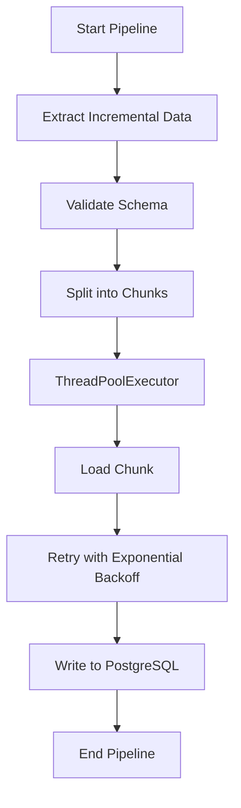
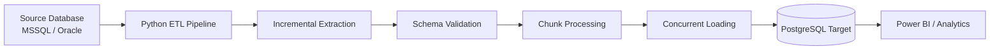

# Data Pipeline ETL – Backend Engineer Technical Test

## Overview

This project implements a **robust backend data pipeline** designed to extract financial data from a legacy system and load it into PostgreSQL for analytical consumption in tools such as Power BI.

The pipeline focuses on **performance, reliability, and clean architecture**, following best practices for backend data engineering.

---

## Architecture

The pipeline follows a modular ETL architecture:

Source Database  
↓  
Incremental Extraction  
↓  
Validation & Transformation  
↓  
Batch Processing (Chunking)  
↓  
Concurrent Loading  
↓  
PostgreSQL Target

## Pipeline Workflow



## Architecture Diagram



## Project Structure

The project structure separates responsibilities clearly:
```
src/
│
├── db
│ └── connection.py
│
├── extract
│ └── extractor.py
│
├── load
│ ├── loader.py
│ └── retry_loader.py
│
├── utils
│ ├── chunking.py
│ └── schema_validator.py
│
└── pipeline.py
```

---

## Key Features

### Incremental Extraction
The pipeline extracts only new or updated records using a timestamp column, preventing unnecessary processing of historical data.

### Batch Processing
Data is processed in chunks to optimize database operations and avoid memory overload.

### Concurrency
Parallel processing is implemented using **ThreadPoolExecutor**, enabling efficient batch loading.

### Retry Strategy
Database operations are protected using **exponential backoff retry logic** implemented with the `tenacity` library.

### Schema Validation
Incoming data is validated before loading to ensure compatibility with the destination schema.

### Connection Pooling
Database connections are managed through SQLAlchemy connection pools to prevent excessive connection creation.

### Containerized Environment
The entire environment is containerized using Docker and Docker Compose to ensure reproducibility.

---

## Tech Stack

- Python
- SQLAlchemy
- Pandas
- PostgreSQL
- Docker / Docker Compose
- Pytest
- Azure Pipelines (CI/CD)

---

## Running the Project

### 1. Start the database

```bash
docker-compose up -d
```

### 2. Run the pipeline
```bash
python src/pipeline.py
```

### Running Tests
```bash
pytest
```

### CI/CD
The repository includes an Azure Pipelines configuration that automatically runs tests when changes are pushed to the repository.

### Design Decisions

Modular architecture separating extraction, transformation, and loading logic

Incremental data ingestion to improve efficiency

Batch processing to optimize database IO

Retry patterns to improve resiliency

Containerized infrastructure for reproducibility

## Author
Andrés Agudelo